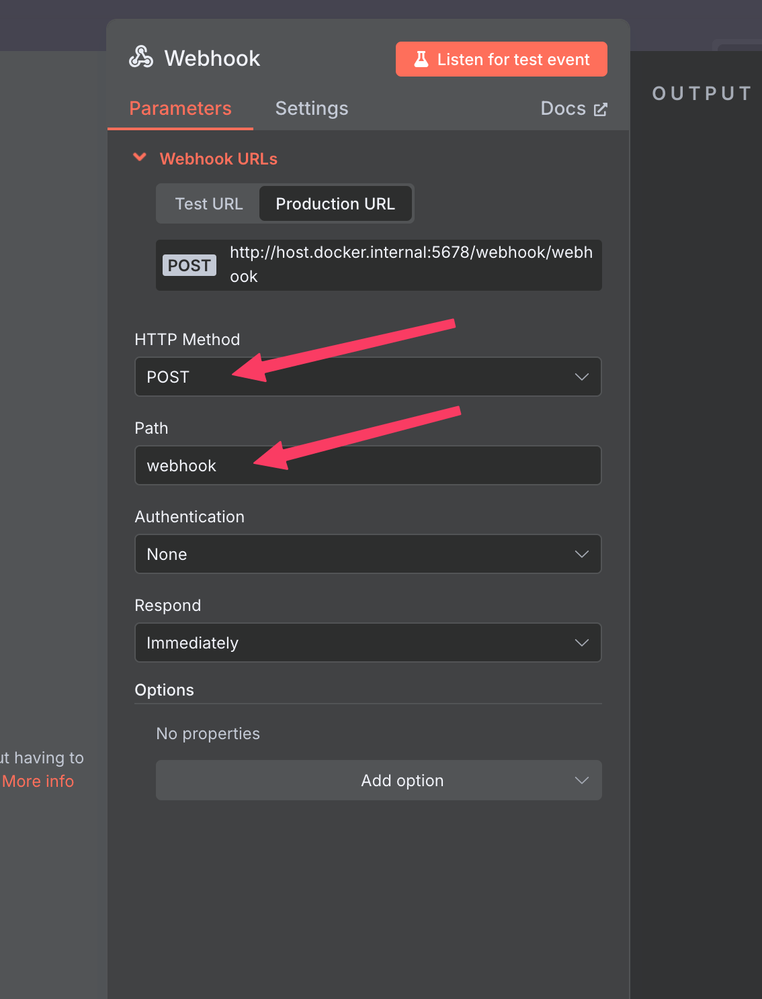

# Tutorial: Instalação e Configuração da Estrutura para Agente de IA Local

---

<div align="center">
  
</div>

---

## Introdução

Este tutorial vai guiar você através do processo de instalação e configuração da nossa estrutura para criação de um Agente de IA Local, incliuindo os componentes:

- **WAHA**: API de Whatsapp gratuita
- **n8n**: Plataforma de automação
- **Redis**: Banco de dados em memória para registro de chats
- **PostgreSQL** (Opcional): Banco de dados relacional para uso geral

## Pré-requisitos

- Ter o Docker Desktop instalado [Baixe aqui](https://www.docker.com/get-started/)
- Sistema operacional Windows 10, Windows 11 ou MacOs

## Passo a Passo

### 1. Faça download deste repositório:


### 2. Extraia o arquivo e abra a pasta:


### 3. Abra um terminal na pasta e digite o comando:
```bash
docker-compose up -d
```
*Isso irá baixar e instalar todos os programas no seu computador local.*


### 4. Acessando os programas:

*Você pode acessar os programas no seu navegador clicando no link do container  através do seu aplicativo Docker Desktop.*


### 5. Instale os nodes do WAHA no N8N:

*Vá no painel settings > community nodes, clique em "install a community node" e digite:*
```bash
n8n-nodes-waha
```


### 6. Conectando credenciais:

*Ao conectar as credenciais dos outros programas no N8N, você deve se atentar ao seguinte detalhe: **SEMPRE SUBSTITUA a palavra "localhost" por "host.docker.internal"**.*

```bash
host.docker.internal
```

*Todos os users e senhas estão configurados como "default".* 

*Exemplo:*


---

## Integração do Whatsapp no N8N

### 1. Conecte seu whatsapp no WAHA através do Qr Code no dashboard:


### 2. Conecte o WAHA ao N8N:

*Deixei a variável global do Webhook configurada como:*
```bash
http://host.docker.internal:5678/webhook/webhook
```
*Então, tudo que você precisa fazer é criar um novo workflow, adicionar um webhook e configurá-lo da seguinte forma:*



*Você verá os eventos que chegaram no seu painel "executions" dentro do workflow do n8n.*

*Você também pode copiar a URL de teste e colar diretamente nas configurações da sessão no dashboard do Waha:*


*Essas URLS que colamos através do dashboard somem após reiniciarmos o container, então, toda vez que quiser desenvolver, lembre-se de copiar a URL de teste e colar diretamente nas configurações da sessão no dashboard do Waha.*


---

## Conclusão

Parabéns! Você agora tem uma estrutura completa para criar seu Agente de IA de forma Local funcionando!


## Recursos Adicionais

- [Documentação do WAHA](https://waha.devlike.pro/docs/overview/introduction)

---

*Última atualização: 07/05/2025*